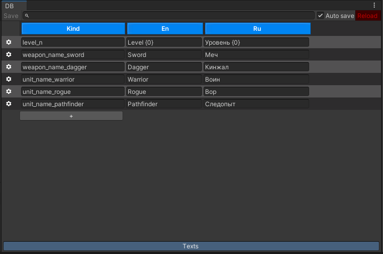
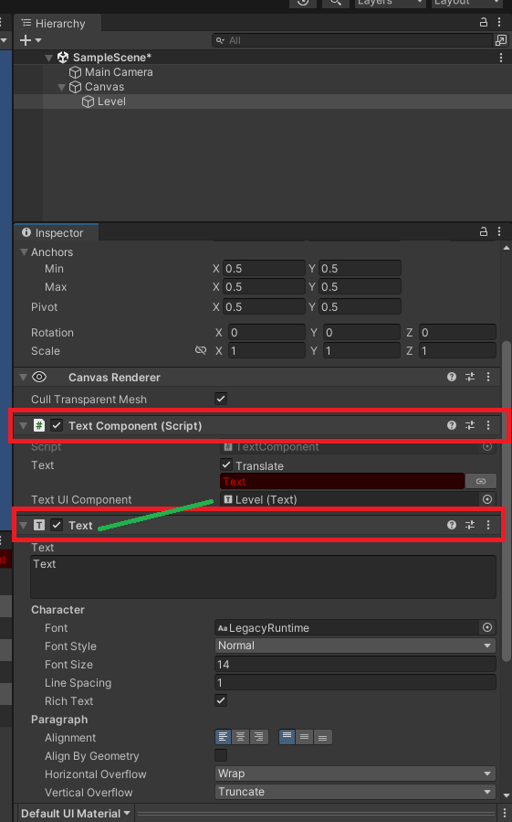
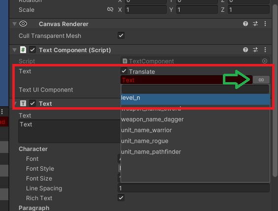
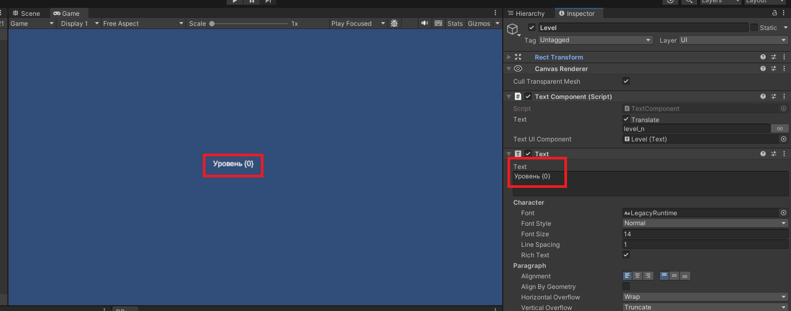
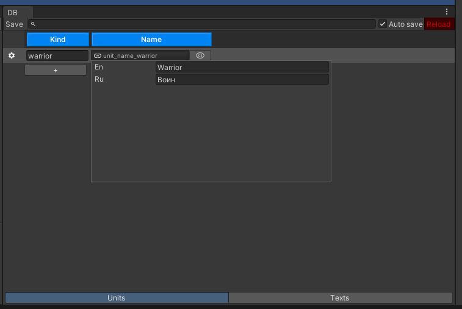
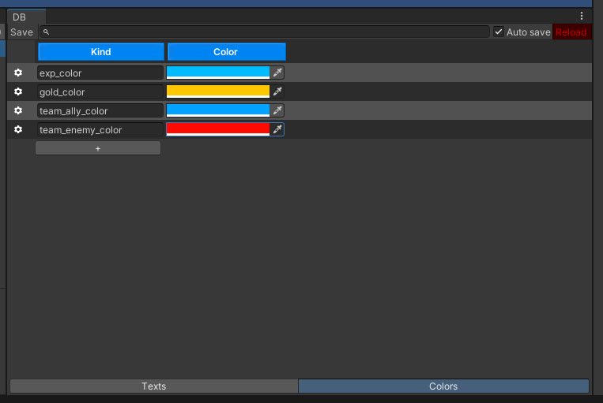
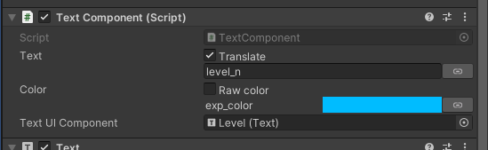

[](https://openupm.com/packages/com.pixelrebels.fdb.components/)

# FuryDB Components

Components for integrate [FuryDB](https://github.com/ze0nni/FDB) with unity.

- [Install](#install)
- [How to use](#hot-to-use)
- [Manupulate with text](#manupulate-with-text)
- [Dynamic change language](#dynamic-change-language)
- [Color palette](#color-palette)

# Install 

This package depend from `FuryDB`. First install it using [this instruction](https://github.com/ze0nni/FDB/blob/master/Doc/Install/README.md)

Or this link

> `https://github.com/ze0nni/FDB.git`

Second dependency is `Fury.Strings` install it by follow link:

> `https://github.com/ze0nni/FuryStrings.git`

Thirdly. Install `FuryDB Components` package by this link:

> `https://github.com/ze0nni/FuryDB.Components.git`

# Hot to use

Read details how to work with `FuryDB` [Here](https://github.com/ze0nni/FDB/blob/master/README.md). Now look how to work with localizations text.

For example create table with texts Index:

```DB.cs
[FuryDB("Assets/Resources/DB.json.txt", "Assets/Kinds.cs")]
[JsonConverter(typeof(DBConverter<DB>))]
class DB {
    public Index<TextConfig> Texts;
}

class TestConfig {
    public Kind<TextConfig> Kind;
    public string En;
    public string Ru;
}
```

And here Boot class of yor game. You need load database and store it in static variable.

```Boot.cs
class Boot : MonoBehaviour
{
    public static DB DB { get; private set; }

    private void Awake()
    {
        DB = DBResolver.Load<DB>();
    }
}
```

And fill it with same data:



Lets create component who can render localizable text:

```TextComponent.cs
using UnityEngine;
using FDB.Components;
using UnityEngine.UI;
using FDB;

class TextComponent : TextComponentBase<DB, TextConfig, TextResolver>
{
    // Here you can add any text renderer compont
    // Like Text TMP_Text or TextMeshProUGUI
    [SerializeField] Text _textUIComponent;

    protected override void Render(string text)
    {
        if (_textUIComponent)
        {
            //And just apply result string in Render function
            _textUIComponent.text = text;
        }
    }
}

struct TextResolver : ITextResolver<TextConfig>
{
    public Index<TextConfig> Index => Boot.DB.Texts;
    public string GetText(TextConfig config) => config.Ru;
}
```

You must declare three types in TextComponentBase<>:
- First `DB` - type of your database class
- Second `TextConfig` - class you using for store localization strings
- And last `TextResolver` - this in empty struct who can two fields:
  - Indext<TextConfig> - this property return data static data from `DB.Texts` you loaded in `Boot`
  - GetText(TextConfig config) - this function know about player language and return prefred string. An implementation might look like this:
    ```
    public string GetText(TextConfig config) {
        switch (Application.systemLanguage) {
            case SystemLanguage.Russian:
                return config.Ru;
            default:
                return config.En;
        }
    }
    ```

Now go to scene gameobject with and create `Text` and `TextComponent`. Dont forget drag `Text` to field `Text UI Component`.



Check if toggle `Translate` is on and click to `Link` button. Select in drop down menu item `level_n`



As you see `Text` display string from config:



If you want manipulate with format string this is simple:

```Boot.cs
class Boot : MonoBehaviour
{
    public static DB DB { get; private set; }

    // Add link to TextComponent from scene
    [SerializeField] TextComponent _level;

    private void Awake()
    {
        DB = DBResolver.Load<DB>();

        // And set value for argument {0} 
        _level.SetArgs(99);
    }
}
```

Run game and enjoy result:


# Manupulate with text

`TextComponent` has method to manipulate with text:

## SetText(string textTex) 

This method turn off toggle `Translate` and display textTex as is.

```Boot.cs
_textComponent.SetText("{0}/{1}");
_textComponent.SetArgs(3, 5)
```
Will render text `"3 / 5"`

## SetText(Kind<TextConfig> kind)

This method turn on toggle `Translate` and
begin use `TextConfig` to localize text. 

You can find texts kinds in `Kinds.cs` this class generate from database data. For example

```Boot.cs
_textComponent.SetText(Kinds.Texts.weapon_name_sword);
```

This is not recommended, but you can create composite Kind in runtime:

```Boot.cs
var lang = Application.systemLanguage;
_textComponent.SetText(new Kind<TextConfig>($"language_{lang}"));
```

Component will try search Config with same Kind./

You can get `Kind` from other configs. For example `UnitConfig` has field `Name` with type `Ref<TextConfig>`

```DB.cs
class DB {
    Index<UnitConfig> Units;
    Index<TextConfig> Texts;
}

class Unit {
    public Kind<Unit> Kind;
    public Ref<TextConfig> Name;
}

void DisplayUnitName(UnitConfig unit) {
    _unitName.SetText(unit.Name.Kind);
}
```



# Dynamic change language

If you have settings where player can chane language in runtime you need modify `TextComponent` for catch events of change language

```PlayerSettings.cs
static class PlayerSettings {
    public static event Action OnLanguageChanged;

    public static SystemLanguage Language { get; private set; }
    public static void UpdateLanguage(SystemLanguage value) {
        Language = value;
        OnLanguageChanged?.Invoke();
    }
}

class TextComponent : TextComponentBase<DB, TextConfig, TextResolver>
{
    [SerializeField] Text _textUIComponent;

    void OnEnable()
    {
        // Just call SetDirty when settings changed
        PlayerSettings.OnLanguageChanged += SetDirty;
    }

    void OnDisable()
    {
        PlayerSettings.OnLanguageChanged -= SetDirty;
    }

    protected override void Render(string text)
    {
        if (_textUIComponent)
        {
            _textUIComponent.text = text;
        }
    }
}

struct TextResolver : ITextResolver<TextConfig>
{
    public Index<TextConfig> Index => Boot.DB.Texts;
    public string GetText(TextConfig config) {
        // Use language from PlayerSettings
        switch (PlayerSettings.Language) {
            case SystemLanguage.Russian:
                return config.Ru;
            default:
                return config.En;
        }
    }
}
```

# Color palette

`FyruDB Components` containst classes for work with color palette from configs. First declare confgis for in-game colors:

```DB.cs
class DB {
    public Input<TextConfig> Texts;
    public Input<ColorConfig> Colors;
}

public class ColorConfig {
    public Kind<ColorConfig> Kind;
    public Color Color;
}
```



Next create class for store color data:


> [!WARNING]
> Dont forget `[Serializable]` attribute

```ColorValue.cs
[Serializable]
class ColorValue : ColorValueBase<DB, ColorConfig, ColorResolver>
{
}

struct ColorResolver : IColorResolver<ColorConfig>
{
    public Index<ColorConfig> Index => Boot.DB.Colors;
    public Color GetColor(ColorConfig config) => config.Color;
    public Color[] GetColors(ColorConfig config) => new Color[] { config.Color };
}
```

And modify `TextComponent` for use palette's:

```TextComponent.cs
class TextComponent : TextComponentBase<DB, TextConfig, TextResolver>
{
    [SerializeField] ColorValue _color; //ColorField

    [SerializeField] Text _textUIComponent;

    //Methods for update color in runtime
    public void SetColor(Color color)
    {
        _color.SetColor(color);
        SetDirty(); // Dont forget mark component for repaint
    }

    public void SetColor(Kind<ColorConfig> kind)
    {
        _color.SetColor(kind);
        SetDirty();
    }

    protected override void Render(string text)
    {
        if (_textUIComponent)
        {
            _textUIComponent.text = text;
            _textUIComponent.color = _color.Color; // Apply color to text
        }
    }
}
```



Now you can use `ColorValue` in other components it's peek data from `ColorConfig`.
